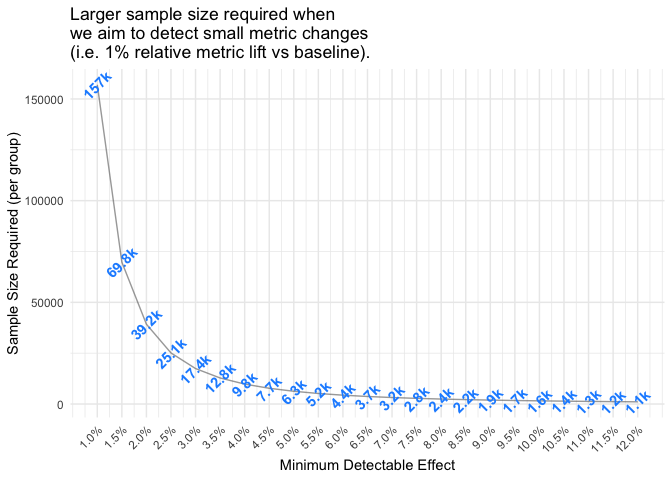
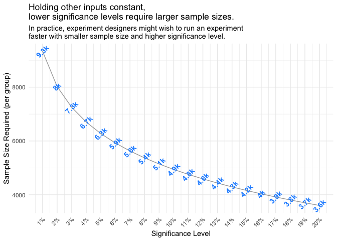
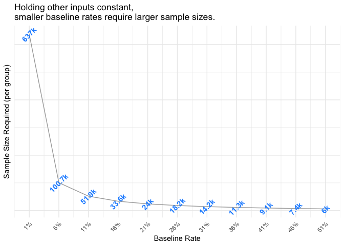

A/B Test Sample Size: Rate Primary Metric
================

# Packages

``` r
library(tidyverse)
```

# Overview

  - For traditional A/B test methods, it’s best practice to decide on
    sample size in advance.
  - We launch the experiment and assess results once the target sample
    size is achieved.
  - Business stakeholders are often keen to understand why a test will
    take X amount of time or require Y sample size.
  - We can use data visualizations to highlight how sample size
    requirements shift as experiment statistics vary.
  - For this analysis, we assume the A/B test target metric is a
    proportion or rate.
  - Having an intuitive grasp on the below concepts helps when fielding
    questions live with business leaders.

# Per test group, sample size requirement for different minimum detectable effects

  - Hold power constant at 80%
  - Hold significance level constant at 5%
  - Hold baseline action rate at 50%
  - Vary minimum detectable effects

<!-- end list -->

``` r
mde_df <- expand_grid(power = 0.8,
            sig_level = 0.05,
            p1_baseline_rate = 0.5,
            MDE = seq(0.01, .12, by=0.005)) %>%
      mutate(p2_improvement = p1_baseline_rate * (1 + MDE)) %>%
      rowwise() %>%
      mutate(sample_size_target = power.prop.test(p1=p1_baseline_rate,
                                                  p2=p2_improvement,
                                                  sig.level = sig_level,
                                                  power = power)$n)

mde_df %>%
      ggplot(aes(x=MDE,
                 sample_size_target,
                 group=1)) +
      geom_line(color="grey40", alpha=0.6) +
      geom_text(aes(label=paste0(round(sample_size_target/1000, 1), "k")),
                angle=45, 
                hjust=0.5,
                fontface="bold",
                color="dodgerblue") +
      theme_minimal() +
      theme(legend.position = "top") +
      labs(title="Larger sample size required when
we aim to detect small metric changes 
(i.e. 1% relative metric lift vs baseline).",
           y="Sample Size Required (per group)",
           x="Minimum Detectable Effect") +
      scale_x_continuous(breaks=seq(0.01, .12, by=0.005),
                         labels = scales::percent_format(accuracy=0.1)) +
      theme(axis.text.x = element_text(angle = 45, hjust = 1, vjust = 1))
```

<!-- -->

# Per group, sample size requirement for different significance levels

  - Hold power constant at 80%
  - Hold minimum detectable effect at 5%
  - Hold baseline action rate at 50%
  - Vary significance level

<!-- end list -->

``` r
sig_df <- expand_grid(power = 0.8,
            sig_level = seq(.01, .2, by=0.01),
            p1_baseline_rate = 0.5,
            MDE = 0.05) %>%
      mutate(p2_improvement = p1_baseline_rate * (1 + MDE)) %>%
      rowwise() %>%
      mutate(sample_size_target = power.prop.test(p1=p1_baseline_rate,
                                                  p2=p2_improvement,
                                                  sig.level = sig_level,
                                                  power = power)$n)

sig_df %>%
      ggplot(aes(x=sig_level,
                 sample_size_target,
                 group=1)) +
      geom_line(color="grey40", alpha=0.6) +
      geom_text(aes(label=paste0(round(sample_size_target/1000, 1), "k")),
                angle=45, 
                hjust=0.5,
                fontface="bold",
                color="dodgerblue") +
      theme_minimal() +
      theme(legend.position = "top") +
      labs(title="Holding other inputs constant,
lower significance levels require larger sample sizes.",
           subtitle = "In practice, experiment designers might wish to run an experiment 
faster with smaller sample size and higher significance level.",
           y="Sample Size Required (per group)",
           x="Significance Level") +
      scale_x_continuous(breaks=seq(.01, .2, by=0.01),
                         labels = scales::percent_format(accuracy=1)) +
      theme(axis.text.x = element_text(angle = 45, hjust = 1, vjust = 1))
```

<!-- -->

# Per group, sample size requirement for different baseline conversion rates / proportions

  - Hold power constant at 80%
  - Hold minimum detectable effect at 5%
  - Hold significance level constant at 5%
  - Vary baseline rate

<!-- end list -->

``` r
baseline_df <- expand_grid(power = 0.8,
            sig_level = 0.05,
            p1_baseline_rate = seq(.01, .51, by=0.05),
            MDE = 0.05) %>%
      mutate(p2_improvement = p1_baseline_rate * (1 + MDE)) %>%
      rowwise() %>%
      mutate(sample_size_target = power.prop.test(p1=p1_baseline_rate,
                                                  p2=p2_improvement,
                                                  sig.level = sig_level,
                                                  power = power)$n)

baseline_df %>%
      ggplot(aes(x=p1_baseline_rate,
                 sample_size_target,
                 group=1)) +
      geom_line(color="grey40", alpha=0.6) +
      geom_text(aes(label=paste0(round(sample_size_target/1000, 1), "k")),
                angle=45, 
                hjust=0.5,
                fontface="bold",
                color="dodgerblue") +
      theme_minimal() +
      theme(legend.position = "top") +
      labs(title="Holding other inputs constant,
smaller baseline rates require larger sample sizes.",
           y="Sample Size Required (per group)",
           x="Baseline Rate") +
      scale_x_continuous(breaks=seq(.01, .51, by=0.05),
                         labels = scales::percent_format(accuracy=1)) +
      theme(axis.text.x = element_text(angle = 45, hjust = 1, vjust = 1),
            axis.text.y = element_blank(),
            axis.ticks.y = element_blank())
```

<!-- -->
